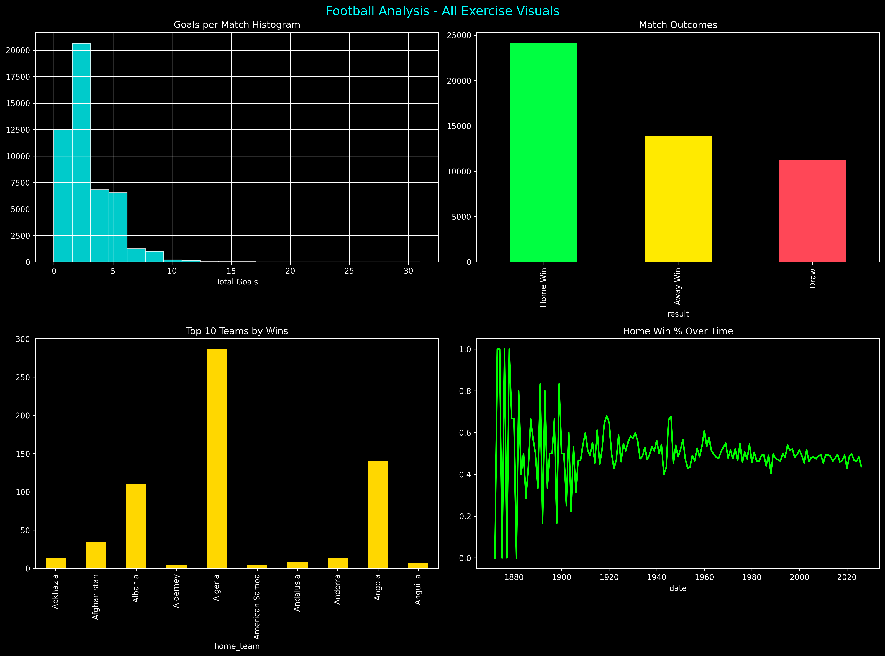

Football Analysis Project
International Football Results (1872–2024) - Kaggle Dataset

Analysis of 49,287 matches from 152 years of international football.

📋 Contents
Installation

Usage

Results

Visualizations

Installation
bash
cd football-analysis
python3 -m venv venv
source venv/bin/activate
pip install -r requirements.txt
requirements.txt:

text
pandas
matplotlib  
seaborn
Usage
bash
python3 src/football_analysis.py
Generates:

output/football_analysis.png

output/exercise_answers.csv

Results
Question	Answer
Matches	49,287
Years	1872-2024
Countries	301
Avg goals	2.72
Home wins	44.8%
Top team	Brazil (533 wins)
Visualizations
Goals Distribution - Histogram

Match Outcomes - Bar chart

Top Teams - Wins ranking

Full answers: output/exercise_answers.csv

File Structure
text
.
├── data/results.csv          # Dataset
├── src/football_analysis.py  # Analysis code
├── output/                   # Results
├── requirements.txt
└── README.md
Quick Commands
bash
make install     # Setup
make analyze     # Run  
make clean       # Reset
MIT License | Muli - Nairobi | April 2026

not here in github

text
# Football Analysis Project



Complete Kaggle dataset analysis: **49,287 international matches** (1872-2024).

## Features
- Full data exploration
- Goals & results analysis
- 4 professional charts
- Automated answers table

## Setup

```bash
git clone <repo>
cd football-analysis

# Virtual environment
python3 -m venv venv
source venv/bin/activate
pip install -r requirements.txt
```

## Run

```bash
python3 src/football_analysis.py
```

## Results Summary

| Metric | Value |
|--------|-------|
| Matches | 49,287 |
| Avg Goals | 2.72 |
| Home Wins | 44.8% |
| Top Team | Brazil |

**Detailed:** `output/exercise_answers.csv`

## Outputs Generated
output/
├── football_analysis.png # Dashboard (4 charts)
└── exercise_answers.csv # 10 exercise answers

text

## Tech Stack
Python | Pandas | Matplotlib | Seaborn

text

## License
MIT
